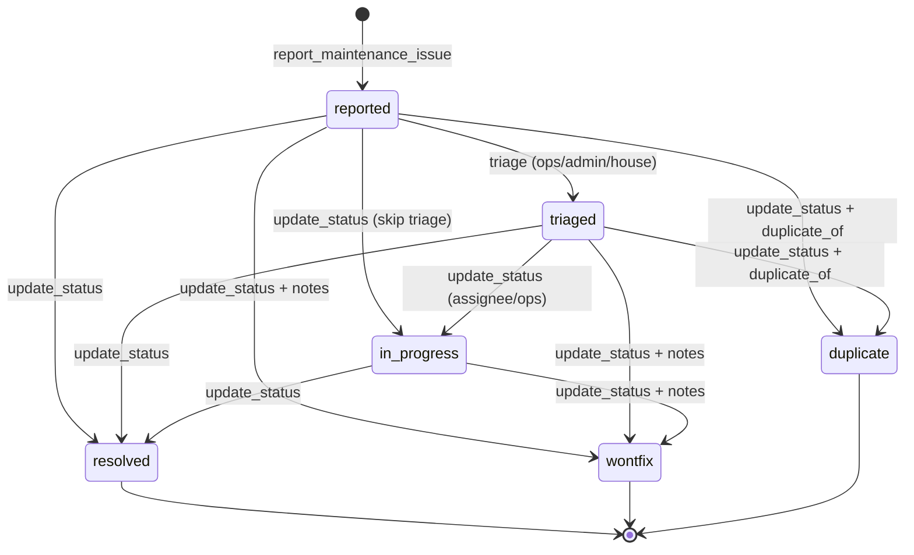
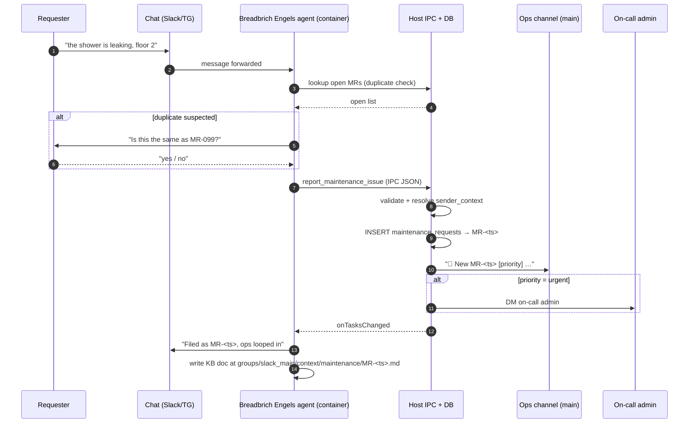
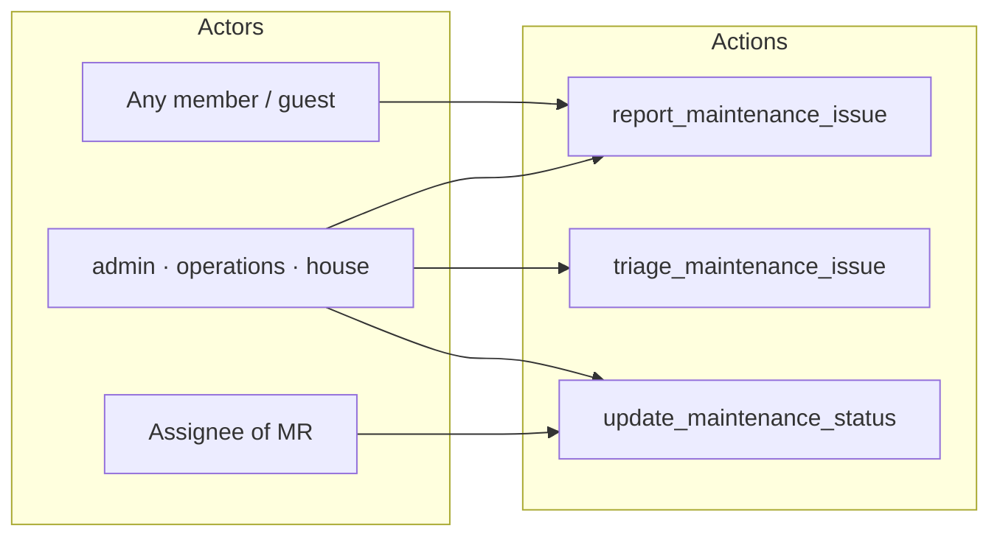
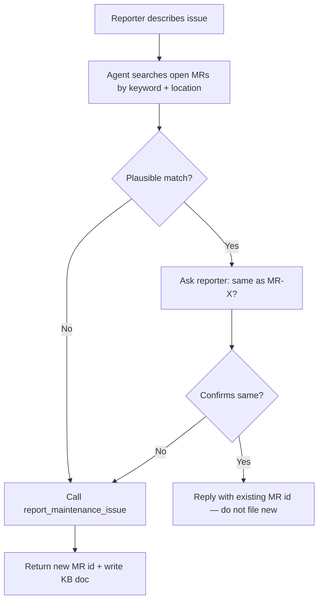
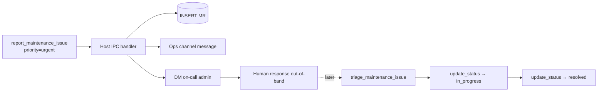

# Breadbrich Engels Workflow Spec — Maintenance Requests

Filled-out instance of `workflow-spec-template-v1.md` for tracking household
maintenance issues reported by residents and guests at the organization.

---

## Workflow: Maintenance Requests

**One-line summary**: Residents report broken/failing things in the house; Breadbrich Engels logs the issue, notifies the operations crew, tracks status through to resolution, and closes the loop with the original reporter.

**Trigger**: Free-form natural language in any Breadbrich Engels-enabled chat, e.g.
- "the shower in the 2nd floor bathroom is leaking"
- "heater in room 3 is dead, it's freezing"
- "wifi in the library has been down all morning"
- "dishwasher won't drain"

**Actors**:
- **Requester** — the person who reported the issue (any member or guest)
- **Triager** — admin or member tagged `operations` / `house` who sets priority and assigns
- **Assignee** — the person responsible for fixing it (often same as triager, may be an external contractor logged as a free-text name)
- **Observers** — main-group operations channel, plus the requester who is auto-subscribed to status updates

**Lifecycle**: `reported` → `triaged` → `in_progress` → `resolved` (or `wontfix` / `duplicate` as terminal states from any prior state)

---

## Layer 1: Database Table

> Add to `src/db.ts` in `createSchema()`. Add a migration block if the DB already exists. Update `schema/tables.md` with the new table definition.

```sql
CREATE TABLE IF NOT EXISTS maintenance_requests (
  id TEXT PRIMARY KEY,                    -- MR-<timestamp>
  chat_jid TEXT NOT NULL,                 -- chat where it was reported
  requester_user_id TEXT NOT NULL,        -- app_users.id of reporter
  -- What/where
  title TEXT NOT NULL,                    -- short human summary ("Shower leaking, floor 2")
  description TEXT,                       -- longer free text from the reporter
  location TEXT,                          -- room_number, space name, or free text ("garden hose bib")
  room_number INTEGER,                    -- optional FK-ish link to rooms.room_number
  -- Triage
  priority TEXT DEFAULT 'normal',         -- 'urgent' | 'high' | 'normal' | 'low'
  category TEXT,                          -- 'plumbing' | 'electrical' | 'hvac' | 'appliance' | 'network' | 'structural' | 'other'
  -- Assignment
  assignee_user_id TEXT,                  -- app_users.id when internal
  assignee_name TEXT,                     -- free-text fallback for external contractors
  -- Lifecycle
  status TEXT DEFAULT 'reported',         -- reported | triaged | in_progress | resolved | wontfix | duplicate
  created_at TEXT NOT NULL,
  triaged_at TEXT,
  started_at TEXT,
  resolved_at TEXT,
  resolved_by TEXT,                       -- app_users.id of whoever closed it
  resolution_notes TEXT,                  -- what was done, parts used, cost
  -- Linkage
  duplicate_of TEXT,                      -- when status=duplicate, MR id this rolls up into
  kb_doc_path TEXT,                       -- relative path to the KB markdown file
  FOREIGN KEY (chat_jid) REFERENCES chats(jid),
  FOREIGN KEY (duplicate_of) REFERENCES maintenance_requests(id)
);

CREATE INDEX IF NOT EXISTS idx_maint_status ON maintenance_requests(status);
CREATE INDEX IF NOT EXISTS idx_maint_requester ON maintenance_requests(requester_user_id);
CREATE INDEX IF NOT EXISTS idx_maint_assignee ON maintenance_requests(assignee_user_id);
```

**DB accessor functions** (add to `src/db.ts` after existing accessors):

| Function | Purpose | SQL |
|----------|---------|-----|
| `createMaintenanceRequest(req)` | Insert new report | INSERT |
| `getMaintenanceRequest(id)` | Fetch by ID | SELECT by PK |
| `getMaintenanceRequestsByStatus(status)` | List by lifecycle state | SELECT WHERE status |
| `getOpenMaintenanceRequests()` | All not-yet-terminal rows | SELECT WHERE status NOT IN ('resolved','wontfix','duplicate') |
| `getMaintenanceRequestsByRequester(userId)` | "What have I reported?" | SELECT WHERE requester_user_id |
| `getMaintenanceRequestsByAssignee(userId)` | Worklist for the fix-it person | SELECT WHERE assignee_user_id AND status NOT IN terminal |
| `updateMaintenanceRequestTriage(id, priority, category, assignee)` | Set priority/category/assignee, bump status to `triaged` | UPDATE + set triaged_at |
| `updateMaintenanceRequestStatus(id, status, actingUserId, notes?)` | Transition lifecycle; stamps started_at/resolved_at as appropriate | UPDATE status + timestamps + resolved_by + resolution_notes |
| `linkMaintenanceDuplicate(id, canonicalId)` | Mark as duplicate of another MR | UPDATE status='duplicate', duplicate_of=? |

---

## Layer 2: Container MCP Tools

> Add to `container/agent-runner/src/ipc-mcp-stdio.ts`. One tool per lifecycle action the agent can take on behalf of a user. Each tool writes an IPC file — it never touches the DB directly.

### 2a. `report_maintenance_issue`

```typescript
server.tool(
  'report_maintenance_issue',
  'Log a new maintenance problem reported by a resident or guest. Use this whenever someone describes something broken, leaking, not working, or needing repair in the house. Do NOT use this for tasks, chores, or to-dos — those go to the task system.',
  {
    title: z.string().min(3).max(120).describe('Short summary suitable for a list, e.g. "Shower leaking, floor 2"'),
    description: z.string().optional().describe('Longer detail from the reporter, verbatim where possible'),
    location: z.string().optional().describe('Free text: room, space, or area'),
    room_number: z.number().int().positive().optional().describe('Room number if the issue is inside a specific bedroom'),
    priority: z.enum(['urgent', 'high', 'normal', 'low']).optional().describe('Urgent = unsafe / no water / no heat / no power. Default normal.'),
    category: z.enum(['plumbing', 'electrical', 'hvac', 'appliance', 'network', 'structural', 'other']).optional(),
  },
  async (args) => {
    const data = {
      type: 'maintenance_report',
      title: args.title,
      description: args.description ?? null,
      location: args.location ?? null,
      room_number: args.room_number ?? null,
      priority: args.priority ?? 'normal',
      category: args.category ?? null,
      groupFolder,
      timestamp: new Date().toISOString(),
    };

    writeIpcFile(TASKS_DIR, data);

    return {
      content: [{ type: 'text' as const, text: `Maintenance issue filed. I'll loop in the ops crew and update you when there's progress.` }],
    };
  },
);
```

### 2b. `triage_maintenance_issue`

```typescript
server.tool(
  'triage_maintenance_issue',
  'Set priority, category, and assignee on an existing maintenance request. Only usable by admins or members with the `operations` or `house` tag. Moves the issue from `reported` to `triaged`.',
  {
    id: z.string().describe('Maintenance request ID (MR-*)'),
    priority: z.enum(['urgent', 'high', 'normal', 'low']).optional(),
    category: z.enum(['plumbing', 'electrical', 'hvac', 'appliance', 'network', 'structural', 'other']).optional(),
    assignee_name: z.string().optional().describe('Full name of the person taking it on. Resolved to app_users if it matches a known member; otherwise stored as external contractor.'),
  },
  async (args) => {
    const data = {
      type: 'maintenance_triage',
      id: args.id,
      priority: args.priority ?? null,
      category: args.category ?? null,
      assignee_name: args.assignee_name ?? null,
      groupFolder,
      timestamp: new Date().toISOString(),
    };
    writeIpcFile(TASKS_DIR, data);
    return { content: [{ type: 'text' as const, text: `Triage recorded for ${args.id}.` }] };
  },
);
```

### 2c. `update_maintenance_status`

```typescript
server.tool(
  'update_maintenance_status',
  'Move a maintenance request to in_progress, resolved, wontfix, or duplicate. The assignee or any admin/ops member can call this. Always include notes on terminal transitions so the requester knows what happened.',
  {
    id: z.string(),
    status: z.enum(['in_progress', 'resolved', 'wontfix', 'duplicate']),
    notes: z.string().optional().describe('What was done / why not fixing / which MR this duplicates'),
    duplicate_of: z.string().optional().describe('Canonical MR id when status=duplicate'),
  },
  async (args) => {
    const data = {
      type: 'maintenance_status',
      id: args.id,
      status: args.status,
      notes: args.notes ?? null,
      duplicate_of: args.duplicate_of ?? null,
      groupFolder,
      timestamp: new Date().toISOString(),
    };
    writeIpcFile(TASKS_DIR, data);
    return { content: [{ type: 'text' as const, text: `Status of ${args.id} set to ${args.status}.` }] };
  },
);
```

**Tool design checklist**:
- [x] Tool names are verb phrases (`report_maintenance_issue`, `triage_maintenance_issue`, `update_maintenance_status`)
- [x] Descriptions tell the agent *when* to use them
- [x] Input validation (enums, min/max lengths) happens at the zod schema
- [x] Responses confirm action and include IDs where the host generates them
- [x] All three tools are gated by `isMain` — maintenance flow lives in the main group only; reports coming from sub-groups are cross-posted by the orchestrator

---

## Layer 3: Host IPC Handlers

> Add three `case` blocks in `processTaskIpc()` in `src/ipc.ts`. Extend the union type on `data` to cover the new fields.

### 3a. `maintenance_report`

```typescript
case 'maintenance_report': {
  if (!data.title || !sourceGroup) {
    logger.warn({ sourceGroup }, 'maintenance_report: missing title or source group');
    break;
  }

  const sender = await readSenderContext(sourceGroup);
  if (!sender?.user_id) {
    logger.warn({ sourceGroup }, 'maintenance_report: cannot resolve requester');
    break;
  }

  const id = `MR-${Date.now()}`;
  const chatJid = resolveChatJidForGroup(sourceGroup);

  createMaintenanceRequest({
    id,
    chat_jid: chatJid,
    requester_user_id: sender.user_id,
    title: data.title,
    description: data.description,
    location: data.location,
    room_number: data.room_number,
    priority: data.priority ?? 'normal',
    category: data.category,
    status: 'reported',
    created_at: new Date().toISOString(),
  });

  // Notify ops channel in main
  await deps.sendMessage(
    OPS_CHANNEL_JID,
    `🔧 New maintenance issue ${id} [${data.priority ?? 'normal'}]\n${data.title}\n— reported by ${sender.display_name}`,
  );

  // Urgent issues also wake up on-call admin via cross-channel DM
  if (data.priority === 'urgent') {
    await deps.notifyOnCallAdmin(`URGENT maintenance: ${id} — ${data.title}`);
  }

  deps.onTasksChanged();
  logger.info({ id, priority: data.priority, requester: sender.user_id }, 'maintenance request created');
  break;
}
```

### 3b. `maintenance_triage`

```typescript
case 'maintenance_triage': {
  if (!data.id) break;
  const sender = await readSenderContext(sourceGroup);
  if (!hasAnyTag(sender, ['admin', 'operations', 'house'])) {
    logger.warn({ sourceGroup, senderId: sender?.user_id }, 'maintenance_triage: unauthorized');
    break;
  }

  const assigneeUserId = data.assignee_name
    ? resolveUserByName(data.assignee_name)?.id ?? null
    : null;

  updateMaintenanceRequestTriage(data.id, {
    priority: data.priority,
    category: data.category,
    assignee_user_id: assigneeUserId,
    assignee_name: data.assignee_name,
    triaged_at: new Date().toISOString(),
  });

  const mr = getMaintenanceRequest(data.id);
  await deps.sendMessage(
    mr.chat_jid,
    `Update on ${data.id}: triaged — priority ${mr.priority}, assigned to ${data.assignee_name ?? 'unassigned'}.`,
  );

  deps.onTasksChanged();
  break;
}
```

### 3c. `maintenance_status`

```typescript
case 'maintenance_status': {
  if (!data.id || !data.status) break;
  const sender = await readSenderContext(sourceGroup);
  const mr = getMaintenanceRequest(data.id);
  if (!mr) break;

  const canAct =
    hasAnyTag(sender, ['admin', 'operations', 'house']) ||
    sender?.user_id === mr.assignee_user_id;
  if (!canAct) {
    logger.warn({ id: data.id, senderId: sender?.user_id }, 'maintenance_status: unauthorized');
    break;
  }

  updateMaintenanceRequestStatus(data.id, data.status, sender.user_id, data.notes);
  if (data.status === 'duplicate' && data.duplicate_of) {
    linkMaintenanceDuplicate(data.id, data.duplicate_of);
  }

  // Close the loop with the original requester
  const reporterDm = await resolveDmJid(mr.requester_user_id);
  if (reporterDm) {
    const msg =
      data.status === 'resolved'
        ? `✅ ${data.id} resolved. ${data.notes ?? ''}`
        : data.status === 'wontfix'
          ? `We won't be fixing ${data.id}. Reason: ${data.notes ?? 'n/a'}`
          : data.status === 'duplicate'
            ? `${data.id} merged into ${data.duplicate_of}.`
            : `${data.id} is now in progress.`;
    await deps.sendMessage(reporterDm, msg);
  }

  deps.onTasksChanged();
  break;
}
```

**IPC handler checklist**:
- [x] Validates required fields before DB write
- [x] Authorization: anyone may `report`; only `admin`/`operations`/`house` may `triage`; assignee OR ops may `status`-update
- [x] Stable ID prefix `MR-` so logs are greppable
- [x] Notifies ops channel on creation, requester on each state change, on-call admin for `urgent`
- [x] Logs include `id`, `priority`, `sender_id` for debugging
- [x] Extend the `processTaskIpc` union to include `maintenance_report`, `maintenance_triage`, `maintenance_status`

---

## Layer 4: Agent Rules

> Create `rules/maintenance/maintenance.md`. Link from `rules/INDEX.md`.

```markdown
# Maintenance Request Rules

## Who Can Report
- Any member, resident, or guest in any Breadbrich Engels-enabled chat
- Reports coming from sub-groups are accepted; the orchestrator cross-posts them to the ops channel in main

## Who Can Triage
- Admins, or members with `operations` or `house` tags
- Triage sets priority, category, and assignee; moves `reported` → `triaged`

## Who Can Change Status
- The assigned fixer (if an internal member) OR any admin / ops / house member
- External contractors cannot change status — their internal point-of-contact does it for them

## Lifecycle
1. **reported** — Just logged. Ops channel notified. Urgent reports also ping on-call.
2. **triaged** — Priority, category, assignee set. Requester gets an update.
3. **in_progress** — Work has started. Requester gets a ping.
4. **resolved** — Fix confirmed by assignee or ops. Requester gets a confirmation with `resolution_notes`.
5. **wontfix** — Decision not to repair (out of scope, deferred). Must include notes. Requester is told.
6. **duplicate** — Merged into another MR. `duplicate_of` is set. Requester is told which MR absorbed theirs.

## Priority Ladder

| Priority | Meaning | Example | SLA (informal) |
|----------|---------|---------|----------------|
| urgent | Safety / habitability | Gas smell, no water, no power, flood | Same hour |
| high | Major inconvenience, affects many | Shared shower broken, fridge dead | Same day |
| normal | Localized, tolerable | One toilet slow to flush, flickering bulb | This week |
| low | Cosmetic, non-functional | Scuffed paint, loose handle | Backlog |

## Notifications
- **On report** → ops channel in main group (always); on-call admin DM if priority=urgent
- **On triage** → requester (same chat where they reported)
- **On in_progress / resolved / wontfix / duplicate** → requester via DM on their originating channel
- **No broadcast** to the whole community — requests are routed, not published

## KB Linkage
- Every MR gets a markdown file under `groups/slack_main/context/maintenance/<MR-ID>.md` (see Layer 5)
- `kb_doc_path` on the DB row points at it

## Constraints
- The agent must NEVER auto-resolve a maintenance request without an explicit human action — there is no "timeout → resolved"
- Do NOT create a maintenance request for tasks, chores, or to-dos. Those go to the task system. Maintenance = something is broken.
- Before creating a new report, search the open list by keyword; if a plausible duplicate exists, ask the user if it's the same issue
- Never expose reporter identity to external contractors in response text — use role descriptions instead
```

**Update `rules/INDEX.md`** — add the row:
```markdown
| [Maintenance](maintenance/maintenance.md) | `rules/maintenance/` | Someone reports something broken / needs repair |
```

---

## Layer 5: KB Documents

Maintenance requests are auditable, often need photos / receipts attached, and humans browse them — so they warrant KB docs.

```
groups/slack_main/context/maintenance/
  index.md                 # Overview: counts by status, link to open items
  MR-1712340000.md         # One file per request
  MR-1712351234.md
  ...
```

**Document frontmatter** (conforms to `rules/knowledge-base/document-format.md`):

```yaml
---
title: Shower leaking, floor 2
id: MR-1712340000
requester: Ada Lovelace
assignee: Grace Hopper
status: in_progress
priority: high
category: plumbing
location: Floor 2 bathroom
created_at: 2026-04-23T14:02:11Z
triaged_at: 2026-04-23T14:18:03Z
visibility: restricted
editable_by: admins, operations
---

## Report
> The shower handle won't shut off all the way — dripping into the grout.
> — Ada, 2026-04-23

## Triage notes
- Likely cartridge worn out. Spare in garage shelf B.

## Work log
- 2026-04-23 — Grace confirmed issue, ordered replacement cartridge.
- ...

## Resolution
_(filled in when status moves to resolved)_
```

**When to use KB docs vs DB-only**: KB doc + DB row, always. Maintenance records need browsing, photo attachments, and handover notes — the DB row is the canonical status record, the KB doc is the human-readable working document.

---

## Layer 6: Agent Instructions

> Append to `groups/slack_main/CLAUDE.md`.

```markdown
## Maintenance Requests

When someone reports something broken, not working, leaking, or in need of repair:
1. Confirm it's a *maintenance* issue, not a task or chore (broken ≠ to-do).
2. Before filing, search open maintenance requests for keyword overlap. If a plausible duplicate exists, ask the reporter if it's the same issue. If yes, reply with the existing MR id instead of creating a new one.
3. Call `report_maintenance_issue` with a crisp `title`, verbatim `description`, `location`, `room_number` if applicable, a `priority` inferred from severity, and a best-guess `category`.
4. After the tool succeeds, write a KB doc at `groups/slack_main/context/maintenance/<MR-ID>.md` using the frontmatter from `rules/maintenance/maintenance.md`.
5. Respond to the reporter: acknowledge, state the MR id, and tell them ops has been looped in. Do not promise a timeline.
6. When ops or the assignee asks you to triage or move status, use `triage_maintenance_issue` / `update_maintenance_status` — never rewrite the DB directly.

See `rules/maintenance/maintenance.md` for the full lifecycle and priority ladder.
```

---

## Layer 7: Container Skill (optional)

Worth it here — maintenance has enough nuance (duplicate detection, priority inference, photo handling) that a dedicated skill keeps `CLAUDE.md` lean.

Create `container/skills/maintenance/SKILL.md`:

```yaml
---
name: maintenance
description: Handle "something's broken" reports — triage, duplicate detection, KB doc authoring, lifecycle updates.
---

# Maintenance Skill

## Priority inference cheat-sheet
- Mentions of: gas, smoke, flood, no water, no heat, no power, unsafe → `urgent`
- "Shared", "everyone", "whole floor", fridge/stove/washer dead → `high`
- One room, one fixture, annoying but livable → `normal`
- Cosmetic, "whenever you get to it" → `low`

## Duplicate detection
Before filing, call `getOpenMaintenanceRequests` (via a host lookup) and fuzzy-match against `title` + `location`. If the cosine / substring similarity is high, surface the candidate and ask.

## Photos
If the reporter sent an image along with the message:
- Save it to `groups/slack_main/context/maintenance/attachments/<MR-ID>/<timestamp>.jpg`
- Link it from the KB doc under a `## Evidence` section

## What NOT to do
- Do not auto-close. Ever.
- Do not escalate priority without explicit reporter or admin confirmation.
- Do not share reporter identity with external contractors — anonymize as "a resident" / "the coordinator".
```

Skills are auto-mounted into containers at `/home/node/.claude/skills/`.

---

## Implementation Checklist

```
[ ] Layer 1: maintenance_requests table + accessors in src/db.ts
[ ] Layer 1: Migration block for existing DBs
[ ] Layer 1: Schema documented in schema/tables.md
[ ] Layer 2: report_maintenance_issue tool in container/agent-runner/src/ipc-mcp-stdio.ts
[ ] Layer 2: triage_maintenance_issue tool
[ ] Layer 2: update_maintenance_status tool
[ ] Layer 3: maintenance_report case in src/ipc.ts processTaskIpc()
[ ] Layer 3: maintenance_triage case
[ ] Layer 3: maintenance_status case
[ ] Layer 3: Type union updated for new data shapes
[ ] Layer 4: rules/maintenance/maintenance.md
[ ] Layer 4: rules/INDEX.md updated
[ ] Layer 5: groups/slack_main/context/maintenance/index.md bootstrapped
[ ] Layer 6: groups/slack_main/CLAUDE.md updated with maintenance section
[ ] Layer 7: container/skills/maintenance/SKILL.md
[ ] Test: reporter in sub-group creates MR; ops channel in main receives notification
[ ] Test: non-ops member cannot triage (authorization denies)
[ ] Test: urgent report pages on-call admin
[ ] Test: resolved status DMs the original reporter with notes
[ ] Test: duplicate merge links both rows and messages both parties
[ ] Rebuild container: ./container/build.sh
```

---

## User Flow Diagrams

### Lifecycle state machine



### Flow A — Reporting an issue



### Flow B — Triage

```mermaid
sequenceDiagram
    autonumber
    participant T as Triager (admin/ops/house)
    participant A as Breadbrich Engels agent
    participant H as Host IPC + DB
    participant R as Requester chat

    T->>A: "Triage MR-123: high, plumbing, assign Grace"
    A->>H: triage_maintenance_issue (IPC)
    H->>H: read sender_context; check tag ∈ {admin,operations,house}
    alt authorized
        H->>H: resolve assignee_name → app_users.id (if internal)
        H->>H: UPDATE priority, category, assignee, status='triaged'
        H->>R: "MR-123 triaged — priority high, assigned Grace"
    else unauthorized
        H-->>H: log warn, drop (no side effects)
    end
```

### Flow C — Status updates (start / resolve / wontfix / duplicate)

```mermaid
sequenceDiagram
    autonumber
    participant Act as Assignee or Ops
    participant A as Breadbrich Engels agent
    participant H as Host IPC + DB
    participant R as Original requester (DM)

    Act->>A: "MR-123 resolved, replaced cartridge"
    A->>H: update_maintenance_status (IPC)
    H->>H: load MR; check actor = assignee OR tag ∈ {admin,ops,house}
    alt authorized
        H->>H: UPDATE status + timestamps + resolved_by + notes
        alt status = in_progress
            H->>R: "MR-123 is now in progress"
        else status = resolved
            H->>R: "✅ MR-123 resolved. <notes>"
        else status = wontfix
            H->>R: "Won't fix MR-123. Reason: <notes>"
        else status = duplicate
            H->>H: linkMaintenanceDuplicate(id, duplicate_of)
            H->>R: "MR-123 merged into MR-099"
        end
    else denied
        H-->>H: log unauthorized, drop
    end
```

### Authorization matrix



### Duplicate-detection decision



### Urgent path (fast lane)



---

## Open Questions

1. **Ops channel JID** — is there a canonical `OPS_CHANNEL_JID` constant, or do we add one to `src/config.ts`? The residency rules already imply a `#house` channel on Slack; confirm with system operator.
2. **On-call rotation** — `notifyOnCallAdmin` in Layer 3 assumes we know who is on-call. If there's no rotation today, fall back to "DM every admin" for urgent reports until a proper rotation exists.
3. **Contractor contact info** — do we want a `contractors` KB directory with phones/rates, or keep it free-text for now? Lean free-text until there's enough repeat contractors to justify a schema.
4. **Cost tracking** — `resolution_notes` is free-form; should parts cost be a separate numeric column for budgeting? Defer until finance actually asks.
